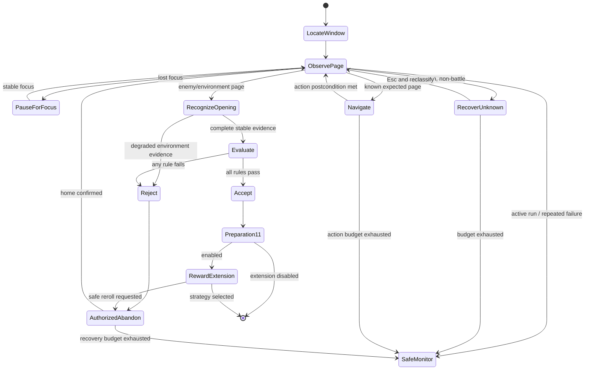

# 第一阶段新架构与流程

## 分层

```text
App (WPF / 配置编辑 / 状态展示)
  → Workflow (运行快照 / 单任务互斥 / 生命周期)
    → Tasks (显式页面状态、有限动作、恢复策略)
      → Game (纯规则、数据 ID、开局评估)
      → Vision (窗口、捕获、模板、OCR、像素)
      → Automation (前台守卫、鼠标键盘端口)
        → Core (坐标、事件、通用契约)
```

新建的 `CurrencyWarsAssistant.Workflow` 是 UI 与自动化之间的应用边界。`Phase1RunConfiguration.Create` 深拷贝开局筛选、组合、Profiles、角色清单、奖励选项和模式，消除运行时读取可变 ViewModel 的耦合。`Phase1AutomationService` 保证同一进程只运行一个任务，并显式发布 Starting、Running、Completed、Cancelled、Failed 生命周期。

低层识别算法和已验证任务端口继续复用。旧 `MainViewModel` 不再直接持有重刷协调器；它只构造配置并调用 Workflow。后续可逐状态把 Tasks 中剩余的大型控制器迁移成独立 handler，而不再次改变 UI 或识别算法。

## 核心状态流



每条输入边都要求“当前状态稳定证据 → 一次有限输入 → 目标状态稳定后置条件”。无法证明后置条件时，不得把点击本身当成成功。

## 异常恢复

- 可恢复识别失败：有限重识别/一次已定义 fallback；失败指纹累计。
- 输入未发送：最多按阶段预算重试，不改变业务状态。
- 输入已发送但结果未知：停止同坐标输入，进入有限观察；仍未知则只读监测。
- 金币不足或购买未成交：原槽连续两帧仍在即停止本批购买。
- 页面未切换：保留原状态，达到预算后只读监测。
- 失焦：冻结活动时间和输入；恢复后重新采集证据，不复用旧帧。
- 用户取消：唯一主动终止；所有异步等待传播 `CancellationToken`。

## 迁移策略

本次没有复制 BetterGI 代码。只采用了可解释的架构思想：任务分层、状态驱动、动作后置验证、恢复与业务流程分离。现有本地 OCR、模板、页面配置、坐标和截图 fixture 是行为黄金样本，只有新测试证明一致或更好时才允许替换。

